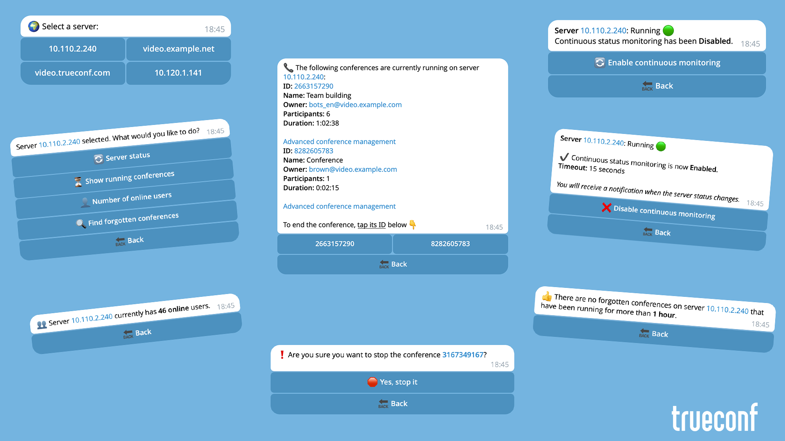
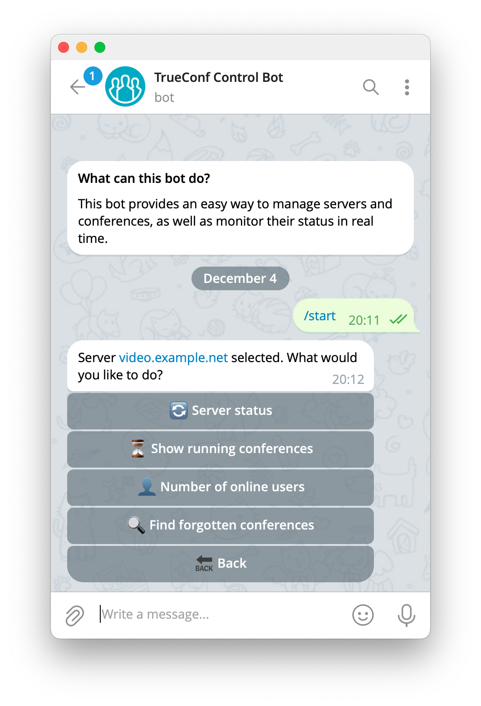

<p align="center">
  <a href="https://trueconf.com" target="_blank" rel="noopener noreferrer">
    <picture>
      <source media="(prefers-color-scheme: dark)" srcset="https://raw.githubusercontent.com/TrueConf/.github/refs/heads/main/logos/logo-dark.svg">
      
    </picture>
  </a>
</p>
<h1 align="center">Bot de Telegram para gestionar el servidor TrueConf</h1>

<p align="center">Acceso al panel de administración desde cualquier parte del mundo a través de la integración de Telegram con TrueConf</p>

<p align="center">
    <a href="https://t.me/trueconf_chat" target="_blank">
        
    </a>
    <a href="https://discord.gg/2gJ4VUqATZ">
        
    </a>
    <a href="#">
        
    </a>
</p>

<p align="center">
  <a href="./README.md">English</a> /
  <a href="./README-ru.md">Русский</a> /
  <a href="./README-de.md">Deutsch</a> /
  <a href="./README-es.md">Español</a>
</p>
<p align="center">
  
</p>

El administrador de [TrueConf
Server](https://trueconf.ru/products/tcsf/besplatniy-server-videoconferenciy.html)
puede acceder rápidamente a la información importante del servidor utilizando
mensajeros populares, como Telegram. Para ello, se puede crear un bot que,
mediante el [TrueConf Server API](https://developers.trueconf.ru/api/server/),
obtenga los datos necesarios. El bot se puede alojar tanto en su servidor local
como en cualquier máquina dedicada.

En este ejemplo, mostraremos cómo crear un bot de Telegram y ejecutarlo en el
servicio en línea Replit, proporcionando un ejemplo listo de código para
implementar la tarea en Python. El bot propuesto tiene las siguientes
capacidades:

1. Verificación del estado del servidor (en funcionamiento/detenido).
2. Obtención de la lista de conferencias en curso.
3. Verificación del número de usuarios en línea.
4. Búsqueda de conferencias activas por error durante un largo período y
detención de cualquiera de ellas.

A continuación, en el texto, las conferencias iniciadas por error se denominan
brevemente "olvidadas", es decir, olvidadas de detener por el propietario y los
moderadores. Por ejemplo, se realizó un seminario web, los invitados lo
abandonaron, y el moderador minimizó la aplicación cliente sin detener el
evento. Este continúa activo, y si la grabación estaba habilitada, ocupa espacio
innecesario en el SSD o HDD con un archivo de grabación en crecimiento.

Por ejemplo, consideramos como "olvidada" una conferencia de este tipo:

- dura más de una hora;
- queda solo el propietario o moderador;
- contiene participantes, pero ninguno de ellos es un moderador.

<div align="center"></div>

## Condiciones necesarias para el lanzamiento

Para que el bot se inicie correctamente, se deben cumplir dos condiciones:

- cada servidor controlado debe ser accesible por su dirección IP o nombre DNS en
el PC donde se ejecuta el bot;
- La PC con el bot debe tener acceso a internet.

> [!NOTE]
> El código proporcionado es un ejemplo sobre el cual puede implementar su propio bot. Tenga en cuenta que la seguridad del bot se garantiza al nivel del protocolo OAuth 2.0 y HTTPS, así como en las configuraciones de red (reglas de acceso, cortafuegos, etc.). El bot opera en el modo **long_polling**, y consulta el servidor de Telegram sobre nuevas actualizaciones de forma independiente. A diferencia del **webhook**, este esquema de conexión es completamente seguro en un entorno corporativo.

## Registro y configuración de su bot

Para utilizar el bot de Telegram, necesitarás el bot oficial
[BotFather](http://t.me/BotFather).

BotFather es el único bot que gestiona los bots en Telegram. Lea más en la
[documentación oficial](https://core.telegram.org/bots).

Para crear un bot:

1. Abra [BotFather](http://t.me/BotFather) y haga clic en **Запустить** o
**Старт**.
1. Se abrirá una lista de las capacidades del bot. Necesitarás el comando
`/newbot`. Haz clic en él en la lista o envía un nuevo mensaje al bot con
`/newbot`.

> [!TIP]
> Más adelante, la lista de comandos disponibles se puede abrir utilizando los botones `Menú` (versión móvil), `/` (versión de escritorio) o simplemente escribiendo `/` en el campo de entrada de mensajes en el chat con BotFather.

Luego, BotFather te pedirá que nombres al nuevo bot. Piensa en un nombre, por
ejemplo, `TCS [name_org]`, donde `[name_org]` es el nombre de tu organización.

Ahora elija un nombre de usuario (username) para su bot. El nombre **debe** incluir la palabra `bot`, ya que es un requisito de Telegram, por ejemplo,
`tcs_[name_org]_bot`.

> [!NOTE]
> Tenga en cuenta que el nombre del bot y su nombre de usuario son nombres públicos por los cuales se puede encontrar a través de la búsqueda global.

Como respuesta, recibirá un mensaje con la información sobre el bot creado y un token de acceso a él mediante el HTTP API en el formato:

```text
5032177032:AAGahjzZ6zbWSEsVFj13Ki-YMPhPEPzQjxE
```

Haga clic en el token en el texto del mensaje para copiarlo al portapapeles.
Luego guárdelo en un lugar seguro, ya que lo necesitará más adelante para usar
el bot.

Para acceder a la configuración de tu bot, ejecuta el comando `/mybots` y
selecciona el nombre de usuario correspondiente. Se abrirá un menú en el que
puedes:

- anular el token actual, y se crea automáticamente un nuevo token;
- editar el nombre, el mensaje de bienvenida, la descripción, la imagen;
- añadir comandos.

Ahora que el bot está configurado, se puede proceder a iniciarlo.

## Preparación del archivo de configuración

Primero, necesitará preparar un archivo de configuración con los datos para
acceder a su bot y los parámetros de los servidores.

Copie el archivo `settings.example.toml` a un nuevo archivo `settings.toml`:

```sh
cp settings.example.toml settings.toml
```

Ahora necesitas completar correctamente esta estructura de datos.

**tg-api-token** — token de acceso al API HTTP de Telegram.

**tg-users-id** — tu ID numérico de Telegram. Telegram garantiza la seguridad del
acceso al bot mediante IDs de usuarios únicos, por lo que necesitarás conocer tu
ID de Telegram para recibir una respuesta del bot. Para obtenerlo, envía
cualquier mensaje al bot [@userinfobot](http://t.me/userinfobot).

> [!TIP]
> Si desea que varias personas tengan acceso al bot, puede escribir sus ID separados por comas.

**locale** — el código del idioma en el que el bot responderá. Puede corregir
frases o agregar su propia traducción en la carpeta `app/locales`.

En `[servers.<server_name>]`, reemplace `<server_name>` por el nombre de servidor
preferido. Este aparecerá en los nombres de los botones:

<div align="center"></div>

**ip** — FQDN o dirección IP del servidor.

**client_id**, **client_secret** estarán disponibles para usted después de crear
una aplicación OAuth2. Puede consultar cómo crearla en [nuestra
documentación](https://docs.trueconf.com/server/admin/web-config/#oauth2).

Para nuestro ejemplo, necesitará marcar los siguientes permisos en la aplicación
OAuth:

- *conferences*;
- *users:read*;
- *logs.calls:read*;
- *logs.calls.participants:read*.

**server_status.state** — activación o desactivación de la verificación
automática de disponibilidad del servidor. Valores: `true` o `false`.

**server_status.timeout** — el tiempo en segundos tras el cual el bot verificará
la disponibilidad del servidor (En funcionamiento, Desconectado). Por defecto,
está establecido en 15 segundos, pero puede introducir su propio valor.

**ssl_certificate** — configuración de verificación del certificado TLS. Si es
`true`, cada solicitud del servidor pasará por una verificación. Si su servidor
utiliza un certificado autofirmado, especifique la ruta hacia él en este
parámetro (utilice la barra inclinada `/`). Si el bot se utiliza en una zona de
confianza (por ejemplo, un servidor ubicado en su red corporativa con acceso
exclusivo para usted), indique `false` para desactivar la verificación del
certificado. Si no se especifica nada `""`, esto equivale a `false`.

Después de completar el archivo, debería tener una estructura como en el ejemplo
a continuación:

```toml
tg-api-token = "12345:example_key"
tg-users-id = [12345, 123456]
locale = "es"

[servers]

[servers."video.example.com"]
ip = "video.example.com"
client_id = "86add683ebc98123968a549f8976db0024abe288"
client_secret = "b7f3f5cb51b02634b1bb546eb7f1f905c93960ba"
access_token = "a5bace995fd9d65315f36518fd7b3b4f68a69557"
ssl_certificate = ""

[servers."video.example.com".server_status]
state = true
timeout = 15

[servers."video.example.net"]
ip = "video.example.net"
client_id = "1ebb5498ddd6668d7885c1597f9a1330fc0caddd"
client_secret = "067171487c59f063287a44c40671d6247d647e42"
access_token = ""
ssl_certificate = true

[servers."video.example.net".server_status]
state = 0
timeout = 15
```

## Inicio del bot

1. Instale Python.
1. Descargue el proyecto. En la página principal del repositorio, haga clic en el
botón **Code → Download ZIP** y descomprima el archivo descargado.
1. Instale `pipenv`:

```sh
pip install pipenv
```

1. Instale las dependencias. Para ello, en la carpeta del proyecto, ejecute el
siguiente comando en la terminal:

```sh
pipenv install --python 3.x
```

donde `--python 3.x` es tu versión de Python. Recomendamos usar la 3.7 o superior.

1. Ejecute el bot:

```sh
pipenv run python3 main.py
```

Al iniciar correctamente el bot, en la terminal aparecerá el mensaje **Bot is
running…**

## Inicio del bot en los servicios en la nube

Puede ejecutar su bot no solo en su máquina local, sino también en la nube, lo
cual es conveniente para un funcionamiento continuo y accesibilidad desde
cualquier lugar. Para ello, puede utilizar varias plataformas en la nube que
ofrecen herramientas convenientes para el desarrollo, pruebas y ejecución de
aplicaciones. A continuación, enumeramos algunos servicios populares donde puede
ejecutar su bot:

- **Replit** — servicio para ejecutar y desarrollar aplicaciones directamente en
el navegador.
- **Heroku** — una plataforma para desplegar y alojar aplicaciones con facilidad
de integración con GitHub.
- **Google Cloud Platform (GCP)** es una potente plataforma con amplias
capacidades para el alojamiento y la gestión de aplicaciones.
- **AWS (Amazon Web Services)** — es una plataforma en la nube de Amazon para
aplicaciones escalables con una variedad de herramientas y servicios.
- **Microsoft Azure** — una plataforma para el desarrollo y gestión de
aplicaciones en la nube con integración en el ecosistema de Microsoft.
- **Glitch**: un servicio para alojamiento rápido y desarrollo de aplicaciones
con una interfaz sencilla e integración con GitHub.

Estos servicios no solo permiten iniciar un bot, sino también escalarlo
fácilmente y garantizar su disponibilidad para los usuarios en cualquier parte
del mundo.
