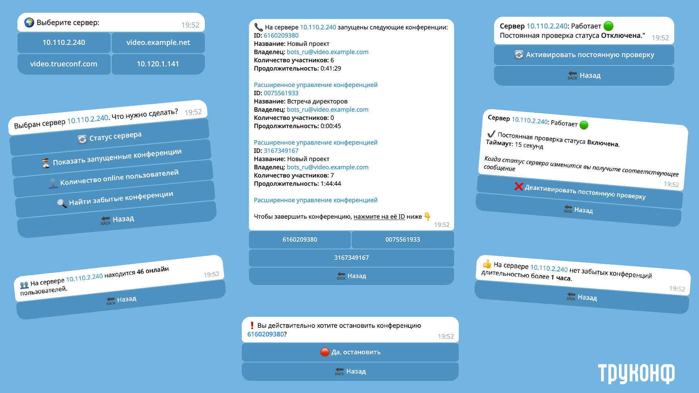
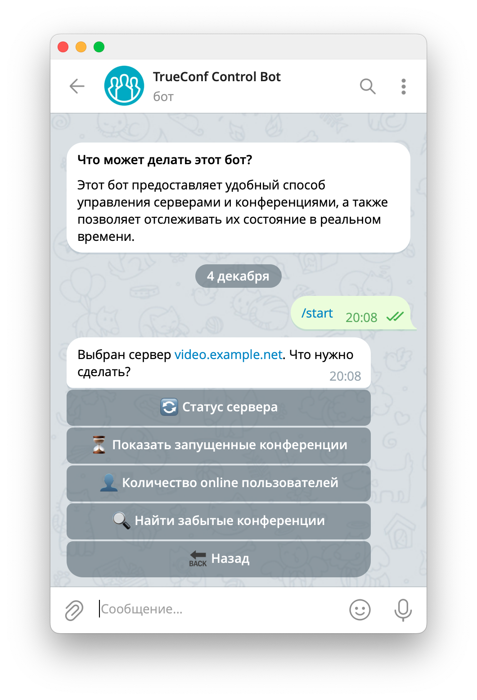
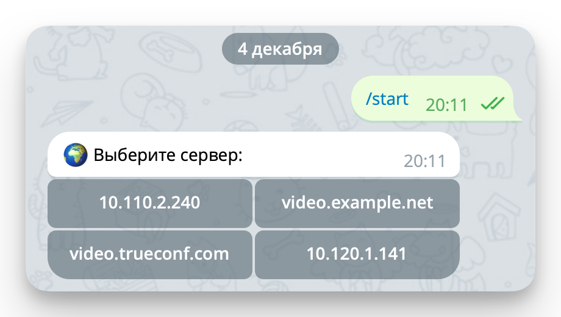

<p align="center">
  <a href="https://trueconf.ru" target="_blank" rel="noopener noreferrer">
    <picture>
      <source media="(prefers-color-scheme: dark)" srcset="logo-cyrillic-dark.svg">
      
    </picture>
  </a>
</p>

<h1 align="center">Telegram бот для управления TrueConf Server</h1>

<p align="center">Доступ к панели управления администратора из любой точки мира через интеграцию Telegram с TrueConf</p>

<p align="center">
    <a href="https://t.me/trueconf_talks" target="_blank">
        
    </a>
    <a href="#">
        
    </a>
</p>

<p align="center">
  <a href="./README.md">English</a> /
  <a href="./README-ru.md">Русский</a> /
  <a href="./README-de.md">Deutsch</a> /
  <a href="./README-es.md">Español</a>
</p>
<p align="center">
  
</p>

Администратор [TrueConf Server](https://trueconf.ru/products/tcsf/besplatniy-server-videoconferenciy.html) может получать быстрый доступ к важной информации сервера, используя для этого популярные мессенджеры, например, Telegram. Для этого можно создать бота, который с помощью [TrueConf Server API](https://developers.trueconf.ru/api/server/) будет получать необходимые данные. Разместить бота можно как на своём сервере локально, так и на любой выделенной машине.

В данном примере мы покажем, как создать Telegram бота, и запустить его на онлайн-сервисе Replit, при этом мы предоставляем готовый пример кода реализации задачи на Python. Предлагаемый бот обладает следующими возможностями:

1. Проверка статуса сервера (работает/остановлен).
2. Получение списка запущенных конференций.
3. Проверка количества онлайн пользователей.
4. Поиск ошибочно активных длительное время конференций и остановка любой из них.

Далее по тексту ошибочно запущенные конференции для краткости названы "забытыми", то есть их забыли остановить владелец и ведущие. Например, проводился вебинар, гости покинули его, а ведущий свернул клиентское приложение, не остановив мероприятие. Оно продолжает идти, а если была включена запись – то и зря занимать место на SSD или HDD разрастающимся файлом записи.

Для примера “забытой” мы считаем такую конференцию:

- она длится дольше одного часа;
- в ней остался один только владелец или ведущий;
- в ней есть участники, но среди них нет ни одного ведущего.

<div align="center"></div>

## Необходимые условия для запуска

Для успешного запуска бота требуется выполнение двух условий:

- каждый контролируемый сервер должен быть доступен по своему IP-адресу или DNS-имени на ПК, где запускается бот;
- ПК с ботом должен иметь выход в интернет.

> [!NOTE]
> Представленный код является примером на основе которого вы можете сами реализовать своего бота. Заметим, что безопасность бота обеспечивается на уровне протокола OAuth 2.0 и HTTPS, а также на стороне настроек сети (правила доступа, брандмауэр и т.п.). Бот работает в режиме **long_polling**, и самостоятельно опрашивает сервер Telegram о новых обновлениях. В отличии от **webhook** такая схема подключения является совершенно безопасной в корпоративной среде.

## Регистрация своего бота и его настройка

Для использования Telegram-бота вам понадобится официальный бот [BotFather](http://t.me/BotFather).

BotFather – это единственный бот, который управляет ботами в Telegram. Подробнее читайте в [официальной документации](https://core.telegram.org/bots).

Чтобы создать бота:

1. Откройте [BotFather](http://t.me/BotFather) и нажмите **Запустить** или **Старт**.
1. У вас откроется список возможностей бота. Вам понадобится команда `/newbot`. Нажмите на неё в списке, или отправьте боту новое сообщение `/newbot`.

> [!TIP]
> В дальнейшем список доступных команд можно открыть с помощью кнопок `Меню`(мобильная версия), `/` (десктопная версия) или просто набрав `/` в поле ввода сообщения в чате с BotFather.

Далее BotFather предложит назвать нового бота. Придумайте название, например `TCS [name_org]`, где `[name_org]` — название вашей организации.

Теперь придумайте имя пользователя (username) для вашего бота.  В имени **обязательно** должно присутствовать слово `bot`, это требование Telegram, например, `tcs_[name_org]_bot`.

>[!NOTE]
> Обратите внимание, что название бота и его имя пользователя – это публичные имена, по которым его можно найти через глобальный поиск.

В ответ вы получите сообщение со сведениями о созданном боте и токеном доступа к нему с помощью HTTP API в виде:

```text
5032177032:AAGahjzZ6zbWSEsVFj13Ki-YMPhPEPzQjxE
```

Нажмите на токен в тексте сообщения, чтобы скопировать его в буфер обмена. После чего сохраните его в надёжном месте – он понадобится вам в дальнейшем для использования бота.

Для того чтобы перейти в настройки вашего бота, выполните команду `/mybots` и выберите соответствующее имя пользователя. У вас откроется меню, в котором можно:

- аннулировать текущий токен, при этом новый токен создаётся автоматически;
- редактировать имя, приветственное сообщение, описание, изображение;
- добавить команды.

Теперь, когда бот настроен, можно перейти к его запуску.

## Подготовка конфигурационного файла

Предварительно вам понадобится подготовить файл настроек с данными для доступа к своему боту и параметрами серверов.

Скопируйте файл `settings.example.toml` в новый файл `settings.toml`:

```sh
cp settings.example.toml settings.toml
```

Теперь вам нужно правильно заполнить эту структуру данных.

**tg-api-token** — токен доступа HTTP API Telegram.

**tg-users-id** — ваш числовой Telegram ID. Telegram обеспечивает безопасность доступа к боту с помощью уникальных ID пользователей, поэтому чтобы вы могли получить ответ от бота, вам понадобится узнать свой Telegram ID. Чтобы получить его, пришлите боту [@userinfobot](http://t.me/userinfobot) любое сообщение.

> [!TIP]
> Если вы хотите, чтобы несколько человек получили доступ к боту, вы можете написать их ID через запятую.

**locale** — код языка, на котором бот будет отвечать. Вы можете исправить фразы или добавить свой перевод в папку `app/locales`.

В `[servers.<server_name>]` замените `<server_name>` на предпочтительное имя сервера. Оно будет отображено в названии кнопок:

<div align="center"></div>

**ip** — FQDN или IP-адрес сервера.

**client_id**, **client_secret** будут доступны вам после создания OAuth2 приложения. О том, как его создать, читайте в [нашей документации](https://docs.trueconf.com/server/admin/web-config/#oauth2).

Для нашего примера вам понадобится отметить такие разрешения в OAuth приложении:

- *conferences*;
- *users:read*;
- *logs.calls:read*;
- *logs.calls.participants:read*.

**server_status.state** — включение или отключение  автоматической проверки доступности сервера. Значения: `true` или `false`.

**server_status.timeout** — время в секундах, через которое бот будет проверять доступность сервера (Работает, Отключен). По умолчанию указано 15 секунд, но вы можете ввести своё значение.

**ssl_certificate** — настройка проверки TLS-сертификата. Если `true`, то каждый запрос сервера будет проходить проверку. Если ваш сервер использует самоподписанный сертификат, то в этом параметре укажите путь к нему (используйте прямой слеш `/`). Если бот используется в доверенной зоне (например, сервер находящийся в вашей корпоративной сети и доступ к ней только у вас), то укажите `false` – это отключит проверку сертификата. Если ничего не указано `""`, то это равносильно `false`.

После заполнения файла у вас должна получится структура как на примере ниже:

```toml
tg-api-token = "12345:example_key"
tg-users-id = [12345, 123456]
locale = "ru"

[servers]

[servers."video.example.com"]
ip = "video.example.com"
client_id = "86add683ebc98123968a549f8976db0024abe288"
client_secret = "b7f3f5cb51b02634b1bb546eb7f1f905c93960ba"
access_token = "a5bace995fd9d65315f36518fd7b3b4f68a69557"
ssl_certificate = ""

[servers."video.example.com".server_status]
state = true
timeout = 15


[servers."video.example.net"]
ip = "video.example.net"
client_id = "1ebb5498ddd6668d7885c1597f9a1330fc0caddd"
client_secret = "067171487c59f063287a44c40671d6247d647e42"
access_token = ""
ssl_certificate = true

[servers."video.example.net".server_status]
state = 0
timeout = 15
```

## Запуск бота

1. Установите Python.
2. Скачайте проект. На главной странице репозитория нажмите кнопку **Code → Download ZIP**, и распакуйте загруженный архив.
3. Установите `pipenv`:

```sh
pip install pipenv
```

4. Установите зависимости. Для этого в папке с проектом выполните в терминале команду:

```sh
pipenv install --python 3.x
```

где `--python 3.x` ваша версия Python. Рекомендуем использовать 3.7 и выше.

5. Запустите бота:

```sh
pipenv run python3 main.py
```

При успешном запуске бота в терминале отобразится надпись **Bot is running…**

## Запуск бота на облачных сервисах

Вы можете запускать вашего бота не только на локальной машине, но и в облаке, что удобно для непрерывной работы и доступности из любого места. Для этого можно использовать различные облачные платформы, которые предлагают удобные инструменты для разработки, тестирования и запуска приложений. Ниже мы перечислим несколько популярных сервисов, на которых можно запустить вашего бота:
- **Replit** — сервис для запуска и разработки приложений прямо в браузере.
- **Heroku** — платформа для развертывания и хостинга приложений с простотой интеграции с GitHub.
- **Google Cloud Platform (GCP)** — мощная платформа с широкими возможностями для хостинга и управления приложениями.
- **AWS (Amazon Web Services)** — облачная платформа от Amazon для масштабируемых приложений с множеством инструментов и сервисов.
- **Microsoft Azure** — платформа для разработки и управления приложениями в облаке с интеграцией в экосистему Microsoft.
- **Glitch** — сервис для быстрого хостинга и разработки приложений с простым интерфейсом и интеграцией с GitHub.

Эти сервисы позволяют не только запустить бота, но и легко масштабировать его, а также обеспечивать его доступность для пользователей в любой точке мира.